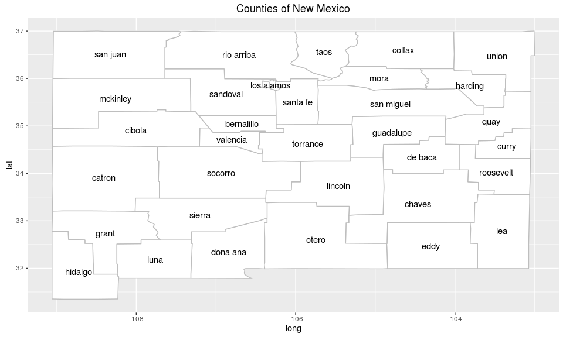
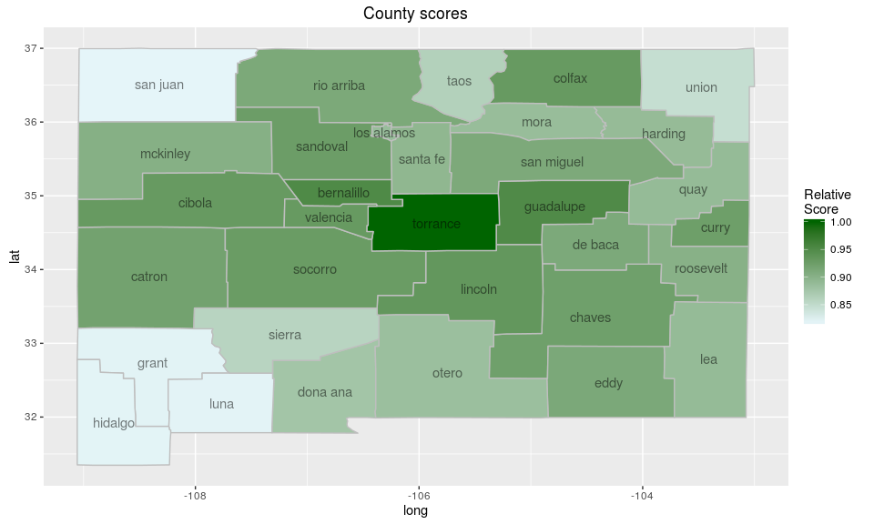

<!-- README.md is generated from README.Rmd. Please edit that file -->
[](https://travis-ci.org/BenjaK/scanstatistics)

scanstatistics
==============

An R package for space-time anomaly detection using scan statistics.

Installing the package
----------------------

To install the development version of this package, type the following:

``` r
devtools::install_github("benjak/scanstatistics")
```

What are scan statistics?
-------------------------

Scan statistics are used to detect anomalous clusters in spatial or space-time data. The gist of the methodology, at least in this package, is this:

1.  Monitor one or more data streams at multiple *locations* over intervals of time.
2.  Form a set of space-time *clusters*, each consisting of (1) a collection of locations, and (2) an interval of time stretching from the present to some number of time periods in the past.
3.  For each cluster, compute a statistic based on both the observed and the expected responses. Report the clusters with the largest statistics.

Main functions
--------------

### Scan statistics

-   **`scan_poisson`**: computes a scan statistic for data following a Poisson distribution.
-   **`scan_negbin`**: computes a scan statistic for data following a negative binomial distribution.
-   **`scan_zip`**: computes a scan statistic for data following a zero-inflated Poisson distribution.

### Zone creation

-   **`knn_zones`**: Creates a set of spatial *zones* (groups of locations) to scan for anomalies. Input is a matrix in which rows are the enumerated locations, and columns the \(k\) nearest neighbors. To create such a matrix, the following two functions are useful:
    -   **`coords_to_knn`**: use `stats::dist` to get the \(k\) nearest neighbors of each location into a format usable by `knn_zones`.
    -   **`dist_to_knn`**: use an already computed distance matrix to get the \(k\) nearest neighbors of each location into a format usable by `knn_zones`.
-   **`flexible_zones`**: An alternative to `knn_zones` that uses the adjacency structure of locations to create a richer set of zones. The additional input is an adjacency matrix, but otherwise works as `knn_zones`.

### Miscellaneous

-   **`score_locations`**: Score each location by how likely it is to have an ongoing anomaly in it. This score is heuristically motivated, not theoretically so.
-   **`top_clusters`**: Get the top \(k\) space-time clusters, either overlapping or non-overlapping in the spatial dimension.

Example: Brain cancer in New Mexico
-----------------------------------

To demonstrate the scan statistics in this package, we will use a dataset of the annual number of brain cancer cases in the counties of New Mexico, for the years \(1973-1991\). This data was studied by Kulldorff et al. (1998), who detected a cluster of cancer cases in the counties Los Alamos and Santa Fe during the years \(1986-1989\), though the excess of brain cancer in this cluster was not deemed statistically significant. The data originally comes from the package *rsatscan* (Kleinman 2015), which provides an interface to the program [SatScan](http://www.satscan.org), but it has been aggregated and extended for the *scanstatistics* package.

To get familiar with the counties of New Mexico, we begin by plotting them on a map using the data table `NM_map` which comes with the *scanstatistics* package:

``` r
library(scanstatistics)
#> Loading required package: data.table
library(ggplot2)

# Load map data
data(NM_map)

# Place the county names at the centroid of the counties. The following function
# calculates the geographical centroids from the polygons in NM_map.
# See: https://en.wikipedia.org/wiki/Centroid#Centroid_of_polygon
polygon_centroid <- function(x0, y0) {
  x1 <- c(x0[-1], x0[1])
  y1 <- c(y0[-1], y0[1])
  A <- sum(x0 * y1 - x1 * y0) / 2
  Cx <- sum((x0 + x1) * (x0 * y1 - x1 * y0)) / (6 * A)
  Cy <- sum((y0 + y1) * (x0 * y1 - x1 * y0)) / (6 * A)
  data.frame(long = Cx, lat = Cy)
}

# Calculate geographic centroids for each county
centroids <- NM_map[, polygon_centroid(long, lat), by = .(subregion)]

# Plot map with labels at centroids
ggplot() + 
  geom_polygon(data = NM_map,
               mapping = aes(x = long, y = lat, group = group),
               color = "grey", fill = "white") +
  geom_text(data = centroids, 
            mapping = aes(x = long, y = lat, label = subregion)) +
  ggtitle("Counties of New Mexico")
```



It should be noted that Cibola county was split from Valencia county in 1981, and cases in Cibola have been counted to Valencia in the data.

### Creating spatial zones

The anomalies considered in the *scanstatistics* package have both a temporal and a spatial component. The spatial component, called a zone, consists of one or more locations grouped together according to their similarity across features. In this example, the locations are the counties of New Mexico and the features are the coordinates of the county seats. These are made available in the data table `NM_geo`. Similarity will be measured using the geographical distance between the seats of the counties, taking into account the curvature of the earth. A distance matrix is calculated using the `spDists` function from the *sp* package, which is then passed to `dist_to_knn` (with \(k=15\) neighbors) and on to `knn_zones`:

``` r
library(sp)
library(magrittr)

data(NM_geo)

zones <- NM_geo[, c("long", "lat"), with = FALSE] %>%
  as.matrix %>%
  spDists(x = ., y = ., longlat = TRUE) %>%
  dist_to_knn(k = 15) %>%
  knn_zones
```

### A scan statistic for Poisson data

The Poisson distribution is a natural first option when dealing with (practically) unbounded count data. The *scanstatistics* package provides the function `scan_poisson`, which is an expectation-based[1] scan statistic for univariate Poisson-distributed data proposed by Neill et al. (2005).

#### Theoretical motivation

For the expectation-based Poisson scan statistic, the null hypothesis of no anomaly states that at each location \(i\) and duration \(t\), the observed count is Poisson-distributed with expected value \(\mu_{it}\): \[
 H_0 \! : Y_{it} \sim \textrm{Poisson}(\mu_{it}),
\] for locations \(i=1,\ldots,m\) and durations \(t=1,\ldots,T\), with \(T\) being the maximum duration considered. Under the alternative hypothesis, there is a space-time cluster \(W\) consisting of a spatial zone \(Z \subset \{1,\ldots,m\}\) and a time window \(D = \{1, 2, \ldots, d\} \subseteq \{1,2,\ldots,T\}\) such that the counts in \(W\) have their expected values inflated by a factor \(q_W > 1\) compared to the null hypothesis: \[
H_1 \! : Y_{it} \sim \textrm{Poisson}(q_W \mu_{it}), ~~(i,t) \in W.
\] For locations and durations outside of this window, counts are assumed to be distributed as under the null hypothesis. Calculating the scan statistic then involves three steps:

-   For each space-time window \(W\), find the maximum likelihood estimate of \(q_W\), treating all \(\mu_{it}\)'s as constants.
-   Plug the estimated \(q_W\) into (the logarithm of) a likelihood ratio with the likelihood of the alternative hypothesis in the numerator and the likelihood under the null hypothesis (in which \(q_W=1\)) in the denominator, again for each \(W\).
-   Take the scan statistic as the maximum of these likelihood ratios, and the corresponding window \(W^*\) as the most likely cluster (MLC).

#### Using the Poisson scan statistic

The first argument to `scan_poisson` should be a **data table** with columns 'location', 'duration', 'count' and 'mu'. The latter two columns contain the observed counts and the estimated Poisson expected value parameters respectively, and the table holds data for the period in which we want to detect anomalies. Locations should be encoded as the integers 1, 2, ..., which means that factor variables can be used for this purpose. The duration column counts time backwards, so that a duration of 1 is the most recent time interval, duration 2 is the second most recent, and so on.

We will create such a table by subsetting the `NM_popcas` table, which holds the population and the number of brain cancer cases for each year between \(1973-1991\) and each county of New Mexico. Note that the population numbers are (perhaps poorly) interpolated from the censuses conducted in 1973, 1982, and 1991.

``` r
data(NM_popcas)

tab <- NM_popcas[year >= 1986 & year < 1990, ]
tab[, duration := max(year) - year + 1]
tab[, location := county]
```

We still need to add the column 'mu', which should hold the predicted Poisson expected value parameter \(\mu_{it}\) for each location \(i\) and time interval \(t\). In this example we would like to detect a potential cluster of brain cancer in the counties of New Mexico during the years \(1986-1989\). Thus, we will use data from the years prior to 1986 to estimate the Poisson parameter for all counties in the years following. A simple generalized linear model (GLM) with a linear time trend and an offset for county population size will suffice to demonstrate the scan statistic. We fit such a model and create the needed column as follows:

``` r
mod_poisson <- glm(count ~ offset(log(population)) + 1 + I(year - 1985), 
                   data = NM_popcas[year < 1986, ], 
                   family = poisson(link = "log"))

# Add the expected value parameter column
tab[, mu := predict(mod_poisson, tab, type = "response")]
```

We can now calculate the Poisson scan statistic. To give us more confidence in our detection results, we will perform 99 Monte Carlo replications, by which data is generated using the parameters from the null hypothesis and a new scan statistic calculated. This is then summarized in a \(p\)-value, calculated as the proportion of times the replicated scan statistics exceeded the observed one. The output of `scan_poisson` is an object of class "scanstatistic", which comes with the print method seen below.

``` r
set.seed(1)
poisson_result <- scan_poisson(tab, zones, n_mcsim = 99)
print(poisson_result)
#> Data distribution:                Poisson
#> Type of scan statistic:           Expectation-based
#> Number of locations considered:   32
#> Maximum duration considered:      4
#> Number of spatial zones:          415
#> Number of Monte Carlo replicates: 99
#> p-value of observed statistic:    0.01
#> Most likely event duration:       4
#> ID of locations in most likely cluster: 15, 26
```

As we can see, the most likely cluster for an anomaly stretches from \(1986-1989\) and involves the locations numbered 15 and 26, which correspond to the counties

``` r
counties <- as.character(NM_geo$county)
counties[c(15, 26)]
[1] "losalamos" "santafe"  
```

These are the same counties detected by Kulldorff et al. (1998), though their analysis was retrospective rather than prospective as ours was. Ours was also data dredging (adjective) as we used the same study period with hopes of detecting the same cluster.

#### A heuristic score for locations

We can score each county according to how likely it is to be part of a cluster in a heuristic fashion using the function `score_locations`, and visualize the results on a heatmap as follows:

``` r
# Calculate scores and add column with county names
county_scores <- score_locations(poisson_result)
county_scores[, county := counties]

# Create a table for plotting
score_map_df <- merge(NM_map, county_scores, by = "county", all.x = TRUE)
score_map_df[subregion == "cibola", 
             relative_score := county_scores[county == "valencia", relative_score]]

ggplot() + 
  geom_polygon(data = score_map_df,
               mapping = aes(x = long, y = lat, group = group, 
                             fill = relative_score),
               color = "grey") +
  scale_fill_gradient(low = "#e5f5f9", high = "darkgreen",
                      guide = guide_colorbar(title = "Relative\nScore")) +
  geom_text(data = centroids, 
            mapping = aes(x = long, y = lat, label = subregion),
            alpha = 0.5) +
  ggtitle("County scores")
```



As we can see, this does not match up entirely with the previous results as Torrance was not part of the most likely cluster.

#### Finding the top-scoring clusters

Finally, if we want to know not just the most likely cluster, but say the five top-scoring space-time clusters, we can use the function `top_clusters`. The clusters returned can either be overlapping or non-overlapping in the spatial dimension, according to our liking.

``` r
top5 <- top_clusters(poisson_result, k = 5, overlapping = FALSE)

# Find the counties corresponding to the spatial zones of the 5 clusters.
top_counties <- top5$zone %>%
  purrr::map(get_zone, zones = zones) %>%
  purrr::map(function(x) counties[x])

# Add the counties corresponding to the zones as a column
top5[, counties := top_counties]
```

To get \(p\)-values for these clusters, the values of the cluster-specific statistics in the table above can be compared to the replicate scan statistics calculated earlier. These \(p\)-values will be conservative, since secondary clusters from the original data are compared to the most likely clusters from the replicate data sets.

``` r
top5[, pvalue := mc_pvalue(statistic, poisson_result$replicated)]

top5
#>    zone duration statistic
#> 1:   49        4 9.1806711
#> 2:    3        2 6.8196550
#> 3:  140        4 3.5377879
#> 4:   10        4 3.4072029
#> 5:    9        2 0.8372729
#>                                               counties pvalue
#> 1:                                   losalamos,santafe   0.01
#> 2:                                              chaves   0.01
#> 3: bernalillo,lincoln,sierra,socorro,torrance,valencia   0.48
#> 4:                                           guadalupe   0.50
#> 5:                                               grant   1.00
```

### A scan statistic for negative binomial data

For count data with overdispersion, the *scanstatistics* package provides the function `scan_negbin`, which is the expectation-based scan statistic invented by Tango, Takahashi, and Kohriyama (2011). This scan statistic assumes that the data follows a negative binomial distribution parametrized by its expected value \(\mu\) and a parameter \(\theta\) such that a count \(Y\) has variance \(\text{Var}(Y) = \mu + \mu^2 / \theta\). The parameters \(\mu\) and \(\theta\) may vary over both location and time.

#### Theoretical motivation

The negative binomial scan statistic comes in two versions, each with a different assumption of how an anomaly with manifest in the data. The first version makes the same assumption as the Poisson scan statistic in the previous section: an anomaly that occurs in a space-time window \(W\) will have the effect of increasing the expected value of the counts in that window by a factor \(q_W>1\) in comparison to what was predicted. This factor \(q_W\) is the same for all locations in \(W\) and constant over time. In the second version of the scan statistic, the factor \(q_W\) increases monotonically over time. The null and alternative hypotheses are otherwise as for the Poisson scan statistic, except that the negative binomial distribution is used instead. Further, the scan statistic is calculated using the score and Fisher information rather than a likelihood ratio.

#### Using the negative binomial scan statistic

Similar to `scan_poisson`, the first argument to `scan_negbin` should be a **data table** with columns 'location', 'duration', 'count', 'mu' and 'theta'. The second and third arguments specify the spatial zones and the number of Monte Carlo replications respectively. The fourth argument specifies the alternative hypothesis; the choices are `version = "ordinary"` (default) and `version = "increasing"`, with the implications described above.

To demonstrate the negative binomial scan statistic, we fit a negative binomial GLM to the data. It should be noted that this is purely for demonstrational purposes: the negative binomial distribution does not fit this data well at all. So if you happen to know of a dataset more suitable, please let me know!

``` r
suppressWarnings(
mod_negbin <- MASS::glm.nb(count ~ offset(log(population)) + 1 + I(year - 1985), 
                         data = NM_popcas[year < 1986, ],
                         link = log)
)

# Add the parameters as columns
tab[, mu := predict(mod_negbin, tab, type = "response")]
tab[, theta := mod_negbin$theta]
```

We can now use `scan_negbin` to find the most likely cluster using the ordinary version of the scan statistic, again making 99 Monte Carlo replications to obtain a \(p\)-value:

``` r
set.seed(1)
negbin_result1 <- scan_negbin(tab, zones, n_mcsim = 99, version = "ordinary")
print(negbin_result1)
#> Data distribution:                negative binomial
#> Type of scan statistic:           expectation-based
#> Number of locations considered:   32
#> Maximum duration considered:      4
#> Number of spatial zones:          415
#> Number of Monte Carlo replicates: 99
#> p-value of observed statistic:    0.07
#> Most likely event duration:       4
#> ID of locations in most likely cluster: 15, 26
```

The ordinary version of the negative binomial scan statistic evidently finds the same cluster as the Poisson scan statistic. The increasing version does not, however:

``` r
set.seed(1)
negbin_result2 <- scan_negbin(tab, zones, n_mcsim = 99, version = "increasing")
print(negbin_result2)
#> Data distribution:                negative binomial
#> Type of scan statistic:           expectation-based
#> Number of locations considered:   32
#> Maximum duration considered:      4
#> Number of spatial zones:          415
#> Number of Monte Carlo replicates: 99
#> p-value of observed statistic:    0.04
#> Most likely event duration:       2
#> ID of locations in most likely cluster: 3
```

The cluster found here consists of Chaves county in the years 1988-1989, which was one of the secondary clusters found by Kulldorff et al. (1998). The results from the two negative binomial scans above could be further explored using the functions `score_locations` and `top_clusters`, just as for the Poisson scan statistic. Since these functions have already been demonstrated, we move on to a scan statistic for data with an excess of zeros.

### A scan statistic for zero-inflated Poisson data

For zero-inflated count data, the *scanstatistics* package provides the function `scan_zip`, which an expectation-based scan statistic for zero-inflated Poisson (ZIP) data devised by Kjellson (2015). The ZIP distribution is parametrized by the expected value \(\mu\) of the Poisson component and the probability \(p\) of a structural zero.

#### Theoretical motivation

The ZIP scan statistic makes a similar assumtion regarding outbreaks as the Poisson scan statistic does: an anomaly that occurs in a space-time window \(W\) will have the effect of increasing the Poisson expected value parameter of the counts in that window by a factor \(q_W>1\) in comparison to what was predicted. This factor \(q_W\) is the same for all locations in \(W\) and constant over the duration of the anomaly. For all windows \(W\) considered, \(q_W\) is estimated using the EM algorithm and a likelihood ratio statistic is computed. The scan statistic is the maximum of these statistics over all windows \(W\).

#### Using the ZIP scan statistic

Similar to `scan_poisson`, the first argument to `scan_zip` should be a **data table** with columns 'location', 'duration', 'count', 'mu' and 'p'. The second and third arguments specify the spatial zones and the number of Monte Carlo replications respectively.

To demonstrate the ZIP scan statistic, we fit a zero-inflated Poisson regression model to the data. Just as for the negative binomial distribution, it should be noted that this is purely for demonstrational purposes: there are probably more suitable datasets out there, and if you happen to know of one, please let me know!

``` r
library(pscl, quietly = TRUE)
mod_zip <- zeroinfl(count ~ offset(log(population)) + 1 + I(year - 1985),
                    data = NM_popcas[year < 1986, ],
                    dist = "poisson", link = "logit")

# Add the parameters as columns
tab[, mu := predict(mod_zip, tab, type = "count")]
tab[, p := predict(mod_zip, tab, type = "zero")]
```

We can now use `scan_zip` to find the most likely cluster, again making 99 Monte Carlo replications to obtain a \(p\)-value:

``` r
set.seed(1)
zip_result <- scan_zip(tab, zones, n_mcsim = 99)
print(zip_result)
#> Data distribution:                zero-inflated Poisson
#> Type of scan statistic:           Expectation-based
#> Number of locations considered:   32
#> Maximum duration considered:      4
#> Number of spatial zones:          415
#> Number of Monte Carlo replicates: 99
#> p-value of observed statistic:    0.01
#> Most likely event duration:       4
#> ID of locations in most likely cluster: 15, 26
```

The zero-inflated Poisson statistic finds the same cluster as Kulldorff et al. (1998).

References
==========

Kjellson, Benjamin. 2015. “Spatiotemporal Outbreak Detection: A Scan Statistic Based on the Zero-Inflated Poisson Distribution.” Master’s thesis, Sweden: Stockholm University, Division of Mathematical Statistics.

Kleinman, Ken. 2015. *Rsatscan: Tools, Classes, and Methods for Interfacing with SaTScan Stand-Alone Software*. <https://CRAN.R-project.org/package=rsatscan>.

Kulldorff, Martin, William F. Athas, Eric J. Feuer, Barry A. Miller, and Charles R. Key. 1998. “Evaluating Cluster Alarms: A Space-Time Scan Statistic and Brain Cancer in Los Alamos.” *American Journal of Public Health* 88 (9): 1377–80.

Neill, Daniel B., Andrew W. Moore, Maheshkumar Sabhnani, and Kenny Daniel. 2005. “Detection of Emerging Space-Time Clusters.” In *Proceedings of the Eleventh ACM SIGKDD International Conference on Knowledge Discovery in Data Mining*, 218–27. ACM.

Tango, Toshiro, Kunihiko Takahashi, and Kazuaki Kohriyama. 2011. “A Space-Time Scan Statistic for Detecting Emerging Outbreaks.” *Biometrics* 67 (1): 106–15.

[1] Expectation-based scan statistics use past non-anomalous data to estimate distribution parameters, and then compares observed cluster counts from the time period of interest to these estimates. In contrast, *population-based* scan statistics compare counts in a cluster tothose outside, only using data from the period of interest.
