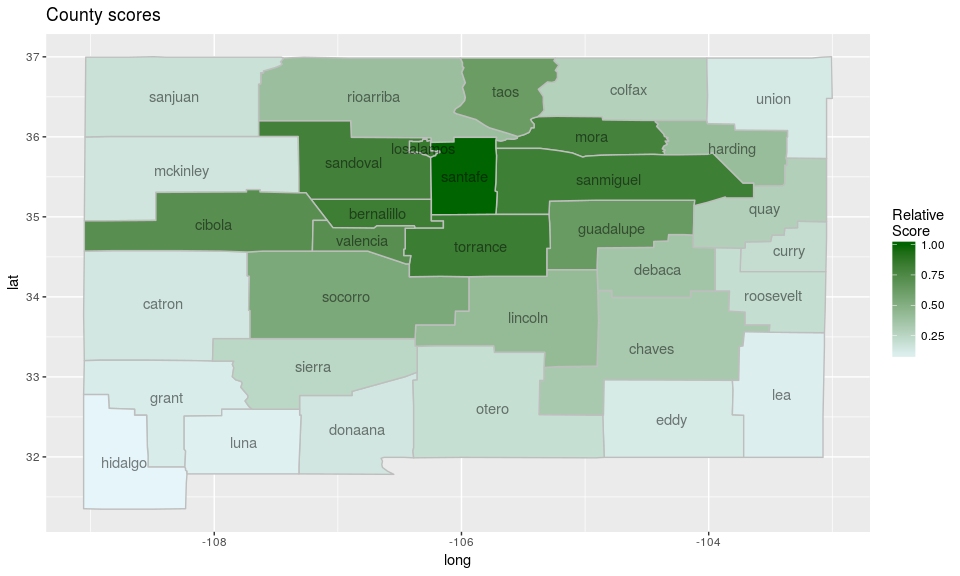

-   [scanstatistics](#scanstatistics)
    -   [Installing the package](#installing-the-package)
    -   [What are scan statistics?](#what-are-scan-statistics)
    -   [Main functions](#main-functions)
        -   [Scan statistics](#scan-statistics)
        -   [Zone creation](#zone-creation)
        -   [Miscellaneous](#miscellaneous)
    -   [Example: Brain cancer in New Mexico](#example-brain-cancer-in-new-mexico)
        -   [A scan statistic for Poisson data](#a-scan-statistic-for-poisson-data)
    -   [Concluding remarks](#concluding-remarks)
-   [Feedback](#feedback)
-   [References](#references)

<!-- README.md is generated from README.Rmd. Please edit that file -->
[](https://travis-ci.org/BenjaK/scanstatistics) [](https://cran.r-project.org/package=scanstatistics) [](http://cran.rstudio.com/web/packages/scanstatistics/index.html)

scanstatistics
==============

An R package for space-time anomaly detection using scan statistics.

Installing the package
----------------------

To install the latest (CRAN) release of this package, type the following:

``` r
install.packages("scanstatistics")
```

To install the development version of this package, type this instead:

``` r
devtools::install_github("benjak/scanstatistics", ref = "develop")
```

What are scan statistics?
-------------------------

Scan statistics are used to detect anomalous clusters in spatial or space-time data. The gist of the methodology, at least in this package, is this:

1.  Monitor one or more data streams at multiple *locations* over intervals of time.
2.  Form a set of space-time *clusters*, each consisting of (1) a collection of locations, and (2) an interval of time stretching from the present to some number of time periods in the past.
3.  For each cluster, compute a statistic based on both the observed and the expected responses. Report the clusters with the largest statistics.

Main functions
--------------

### Scan statistics

-   **`scan_eb_poisson`**: computes the expectation-based Poisson scan statistic (Neill 2005).
-   **`scan_pb_poisson`**: computes the (population-based) space-time scan statistic (Kulldorff 2001).
-   **`scan_eb_negbin`**: computes the expectation-based negative binomial scan statistic (Tango et al. 2011).
-   **`scan_eb_zip`**: computes the expectation-based zero-inflated Poisson scan statistic (Allévius & Höhle 2017).
-   **`scan_permutation`**: computes the space-time permutation scan statistic (Kulldorff et al. 2005).
-   **`scan_bayes_negbin`**: computes the Bayesian Spatial scan statistic (Neill 2006), extended to a space-time setting.

### Zone creation

-   **`knn_zones`**: Creates a set of spatial *zones* (groups of locations) to scan for anomalies. Input is a matrix in which rows are the enumerated locations, and columns the k nearest neighbors. To create such a matrix, the following two functions are useful:
    -   **`coords_to_knn`**: use `stats::dist` to get the k nearest neighbors of each location into a format usable by `knn_zones`.
    -   **`dist_to_knn`**: use an already computed distance matrix to get the k nearest neighbors of each location into a format usable by `knn_zones`.
-   **`flexible_zones`**: An alternative to `knn_zones` that uses the adjacency structure of locations to create a richer set of zones. The additional input is an adjacency matrix, but otherwise works as `knn_zones`.

### Miscellaneous

-   **`score_locations`**: Score each location by how likely it is to have an ongoing anomaly in it. This score is heuristically motivated.
-   **`top_clusters`**: Get the top k space-time clusters, either overlapping or non-overlapping in the spatial dimension.
-   **`df_to_matrix`**: Convert a data frame with data for each location and time point to a matrix with locations along the column dimension and time along the row dimension, with the selected data as values.

Example: Brain cancer in New Mexico
-----------------------------------

To demonstrate the scan statistics in this package, we will use a dataset of the annual number of brain cancer cases in the counties of New Mexico, for the years 1973-1991. This data was studied by Kulldorff (1998), who detected a cluster of cancer cases in the counties Los Alamos and Santa Fe during the years 1986-1989, though the excess of brain cancer in this cluster was not deemed statistically significant. The data originally comes from the package *rsatscan*, which provides an interface to the program [SaTScan](http://www.satscan.org), but it has been aggregated and extended for the *scanstatistics* package.

To get familiar with the counties of New Mexico, we begin by plotting them on a map using the data frames `NM_map` and `NM_geo` supplied by the *scanstatistics* package:

``` r
library(scanstatistics)
library(ggplot2)

# Load map data
data(NM_map)
data(NM_geo)

# Plot map with labels at centroids
ggplot() + 
  geom_polygon(data = NM_map,
               mapping = aes(x = long, y = lat, group = group),
               color = "grey", fill = "white") +
  geom_text(data = NM_geo, 
            mapping = aes(x = center_long, y = center_lat, label = county)) +
  ggtitle("Counties of New Mexico")
```


We can further obtain the yearly number of cases and the population for each country for the years 1973-1991 from the data table `NM_popcas` provided by the package:

``` r
data(NM_popcas)
head(NM_popcas)
#>   year     county population count
#> 1 1973 bernalillo     353813    16
#> 2 1974 bernalillo     357520    16
#> 3 1975 bernalillo     368166    16
#> 4 1976 bernalillo     378483    16
#> 5 1977 bernalillo     388471    15
#> 6 1978 bernalillo     398130    18
```

It should be noted that Cibola county was split from Valencia county in 1981, and cases in Cibola have been counted to Valencia in the data.

### A scan statistic for Poisson data

The Poisson distribution is a natural first option when dealing with count data. The *scanstatistics* package provides the two functions `scan_eb_poisson` and `scan_pb_poisson` with this distributional assumption. The first is an expectation-based[1] scan statistic for univariate Poisson-distributed data proposed by Neill et al. (2005), and we focus on this one in the example below. The second scan statistic is the population-based scan statistic proposed by Kulldorff (2001).

#### Using the Poisson scan statistic

The first argument to any of the scan statistics in this package should be a matrix (or array) of observed counts, whether they be integer counts or real-valued "counts". In such a matrix, the columns should represent locations and the rows the time intervals, ordered chronologically from the earliest interval in the first row to the most recent in the last. In this example we would like to detect a potential cluster of brain cancer in the counties of New Mexico during the years 1986-1989, so we begin by retrieving the count and population data from that period and reshaping them to a matrix using the helper function `df_to_matrix`:

``` r
library(dplyr)
#> 
#> Attaching package: 'dplyr'
#> The following objects are masked from 'package:stats':
#> 
#>     filter, lag
#> The following objects are masked from 'package:base':
#> 
#>     intersect, setdiff, setequal, union
counts <- NM_popcas %>% 
  filter(year >= 1986 & year < 1990) %>%
  df_to_matrix(time_col = "year", location_col = "county", value_col = "count")
```

#### Spatial zones

The second argument to `scan_eb_poisson` should be a list of integer vectors, each such vector being a *zone*, which is the name for the spatial component of a potential outbreak cluster. Such a zone consists of one or more locations grouped together according to their similarity across features, and each location is numbered as the corresponding column index of the `counts` matrix above (indexing starts at 1).

In this example, the locations are the counties of New Mexico and the features are the coordinates of the county seats. These are made available in the data table `NM_geo`. Similarity will be measured using the geographical distance between the seats of the counties, taking into account the curvature of the earth. A distance matrix is calculated using the `spDists` function from the *sp* package, which is then passed to `dist_to_knn` and on to `knn_zones`:

``` r
library(sp)
library(magrittr)

# Remove Cibola since cases have been counted towards Valencia. Ideally, this
# should be accounted for when creating the zones.
zones <- NM_geo %>%
  filter(county != "cibola") %>%
  select(seat_long, seat_lat) %>%
  as.matrix %>%
  spDists(x = ., y = ., longlat = TRUE) %>%
  dist_to_knn(k = 15) %>%
  knn_zones
```

#### Baselines

The advantage of expectation-based scan statistics is that parameters such as the expected value can be modelled and estimated from past data e.g. by some form of regression. For the expectation-based Poisson scan statistic, we can use a (very simple) Poisson GLM to estimate the expected value of the count in each county and year, accounting for the different populations in each region. Similar to the `counts` argument, the expected values should be passed as a matrix to the `scan_eb_poisson` function:

``` r
mod <- glm(count ~ offset(log(population)) + 1 + I(year - 1985),
           family = poisson(link = "log"),
           data = NM_popcas %>% filter(year < 1986))

ebp_baselines <- NM_popcas %>% 
  filter(year >= 1986 & year < 1990) %>%
  mutate(mu = predict(mod, newdata = ., type = "response")) %>%
  df_to_matrix(value_col = "mu")
```

Note that the population numbers are (perhaps poorly) interpolated from the censuses conducted in 1973, 1982, and 1991.

#### Calculation

We can now calculate the Poisson scan statistic. To give us more confidence in our detection results, we will perform 999 Monte Carlo replications, by which data is generated using the parameters from the null hypothesis and a new scan statistic calculated. This is then summarized in a P-value, calculated as the proportion of times the replicated scan statistics exceeded the observed one. The output of `scan_poisson` is an object of class "scanstatistic", which comes with the print method seen below.

``` r
set.seed(1)
poisson_result <- scan_eb_poisson(counts = counts, 
                                  zones = zones, 
                                  baselines = ebp_baselines,
                                  n_mcsim = 999)
print(poisson_result)
#> Data distribution:                Poisson
#> Type of scan statistic:           expectation-based
#> Setting:                          univariate
#> Number of locations considered:   32
#> Maximum duration considered:      4
#> Number of spatial zones:          415
#> Number of Monte Carlo replicates: 999
#> Monte Carlo P-value:              0.005
#> Gumbel P-value:                   0.004
#> Most likely event duration:       4
#> ID of locations in MLC:           15, 26
```

As we can see, the most likely cluster for an anomaly stretches from 1986-1989 and involves the locations numbered 15 and 26, which correspond to the counties

``` r
counties <- as.character(NM_geo$county)
counties[c(15, 26)]
[1] "losalamos" "santafe"  
```

These are the same counties detected by Kulldorff (1998), though their analysis was retrospective rather than prospective as ours was. Ours was also data dredging as we used the same study period with hopes of detecting the same cluster.

#### A heuristic score for locations

We can score each county according to how likely it is to be part of a cluster in a heuristic fashion using the function `score_locations`, and visualize the results on a heatmap as follows:

``` r
# Calculate scores and add column with county names
county_scores <- score_locations(poisson_result, zones)
county_scores %<>% mutate(county = factor(counties[-length(counties)], 
                                          levels = levels(NM_geo$county)))

# Create a table for plotting
score_map_df <- merge(NM_map, county_scores, by = "county", all.x = TRUE) %>%
  arrange(group, order)

# As noted before, Cibola county counts have been attributed to Valencia county
score_map_df[score_map_df$subregion == "cibola", ] %<>%
  mutate(relative_score = score_map_df %>% 
                          filter(subregion == "valencia") %>% 
                          select(relative_score) %>% 
                          .[[1]] %>% .[1])

ggplot() + 
  geom_polygon(data = score_map_df,
               mapping = aes(x = long, y = lat, group = group, 
                             fill = relative_score),
               color = "grey") +
  scale_fill_gradient(low = "#e5f5f9", high = "darkgreen",
                      guide = guide_colorbar(title = "Relative\nScore")) +
  geom_text(data = NM_geo, 
            mapping = aes(x = center_long, y = center_lat, label = county),
            alpha = 0.5) +
  ggtitle("County scores")
```



A warning though: the `score_locations` function can be quite slow for large data sets. This might change in future versions of the package.

#### Finding the top-scoring clusters

Finally, if we want to know not just the most likely cluster, but say the five top-scoring space-time clusters, we can use the function `top_clusters`. The clusters returned can either be overlapping or non-overlapping in the spatial dimension, according to our liking.

``` r
top5 <- top_clusters(poisson_result, zones, k = 5, overlapping = FALSE)

# Find the counties corresponding to the spatial zones of the 5 clusters.
top5_counties <- top5$zone %>%
  purrr::map(get_zone, zones = zones) %>%
  purrr::map(function(x) counties[x])

# Add the counties corresponding to the zones as a column
top5 %<>% mutate(counties = top5_counties)
```

The `top_clusters` function includes Monte Carlo and Gumbel P-values for each cluster. These P-values are conservative, since secondary clusters from the original data are compared to the most likely clusters from the replicate data sets.

Concluding remarks
------------------

Other univariate scan statistics can be calculated practically in the same way as above, though the distribution parameters need to be adapted for each scan statistic.

Feedback
========

If you think this package lacks some functionality, or that something needs better documentation, I happily accept feedback either here at GitHub or via email at <benjak@math.su.se>. I'm also very interested in applying the methods in this package (current and future) to new problems, so if you know of any suitable public datasets, please tell me! A dataset with a multivariate response (e.g. multiple counter variables) would be of particular interest for some of the scan statistics that will appear in future versions of the package.

References
==========

Allévius, B., M. Höhle (2017): *An expectation-based space-time scan statistic for ZIP-distributed data*, (under review).

Kleinman, K. (2015): *Rsatscan: Tools, Classes, and Methods for Interfacing with SaTScan Stand-Alone Software*, <https://CRAN.R-project.org/package=rsatscan>.

Kulldorff, M., Athas, W. F., Feuer, E. J., Miller, B. A., Key, C. R. (1998): *Evaluating Cluster Alarms: A Space-Time Scan Statistic and Brain Cancer in Los Alamos*, American Journal of Public Health 88 (9), 1377–80.

Kulldorff, M. (2001), *Prospective time periodic geographical disease surveillance using a scan statistic*, Journal of the Royal Statistical Society, Series A (Statistics in Society), 164, 61–72.

Kulldorff, M., Heffernan, R., Hartman, J., Assunção, R. M., Mostashari, F. (2005): *A space-time permutation scan statistic for disease outbreak detection*, PLoS Medicine, 2 (3), 0216-0224.

Neill, D. B., Moore, A. W., Sabhnani, M., Daniel, K. (2005): *Detection of Emerging Space-Time Clusters*, In Proceedings of the Eleventh ACM SIGKDD International Conference on Knowledge Discovery in Data Mining, 218–27. ACM.

Neill, D. B., Moore, A. W., Cooper, G. F. (2006): *A Bayesian Spatial Scan Statistic*, Advances in Neural Information Processing Systems 18: Proceedings of the 2005 Conference.

Tango, T., Takahashi, K. Kohriyama, K. (2011), *A Space-Time Scan Statistic for Detecting Emerging Outbreaks*, Biometrics 67 (1), 106–15.

[1] Expectation-based scan statistics use past non-anomalous data to estimate distribution parameters, and then compares observed cluster counts from the time period of interest to these estimates. In contrast, *population-based* scan statistics compare counts in a cluster to those outside, only using data from the period of interest, and does so conditional on the observed total count.
